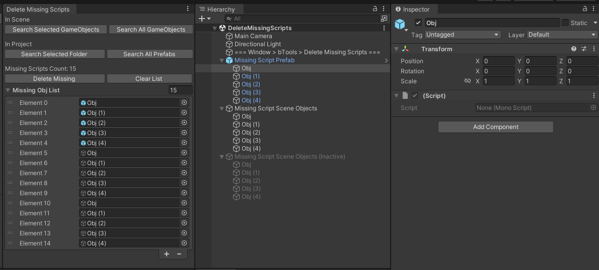

# DeleteMissingScripts

The Unity tool designed to locate missing script components.

> _Author: bwaynesu_  
> _Created: April 18, 2017_  
> _Tags: C#, Unity3D_  
> _Support: Unity 2017 or Higher_

## Features

- Searches for missing script components in scene objects or Prefabs within the project.
- Detects missing scripts even in nested Prefab child objects.
- Works with inactive objects.

## Installation

- Method 1: Download the Unity Package from the Release page and import it into your project.
- Method 2: Copy the `Plugins` folder directly into your project.

## Usage Guide

1. Open the search window: `Window > bTools > Delete Missing Scripts`.
2. Click the search button based on your needs.
3. Click `Delete Missing` to remove all Missing Script Components.
